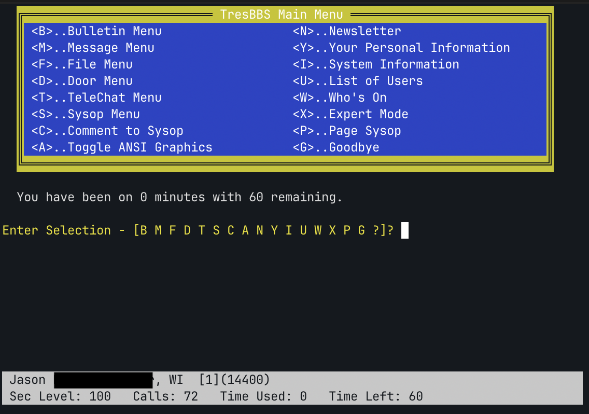
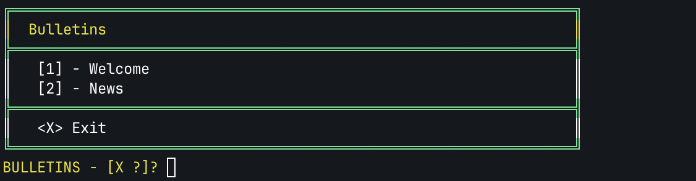
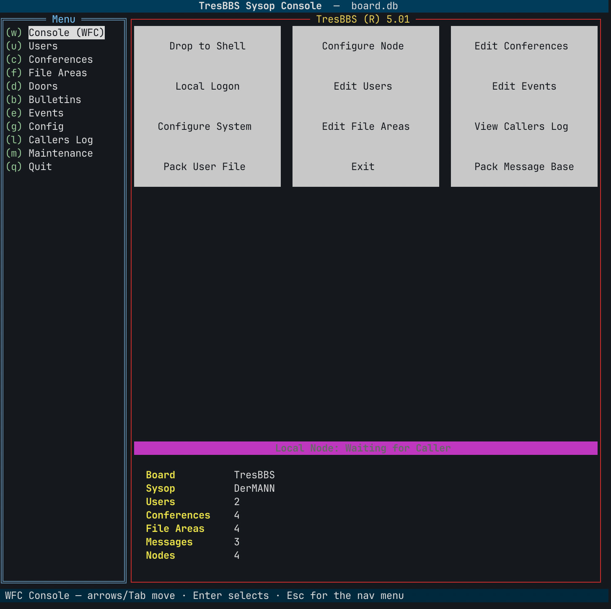

# TresBBS

A spiritual successor to TriBBS — the DOS bulletin-board software a lot of us
grew up dialing into — written from scratch in Go. *("Tres" = French for "very"
/ "three." It's an homage, officer.)*

## Screenshots


*The main menu in glorious CP437/ANSI — `<X>` hotkeys, the `@VARIABLE`/`@X` color engine, and TriBBS's persistent status bar pinned to the bottom.*


*Bulletins, listed and numbered just like the original.*


*The offline sysop console (`tresbbs-admin`) — the modern TRIMAN: Waiting-for-Caller screen, board stats, and keyboard-first editors for users, conferences, doors, and config.*

## What is this?

TresBBS is a complete BBS (Bulletin Board System) implementation in Go. It
re-creates the feel of TriBBS 5.01 / 11.6 — the `@VARIABLE` template engine, the
menu system, doors, multinode chat, QWK mail — on modern infrastructure (TCP and
SSH instead of modems, SQLite instead of flat files).

And crucially: **it reads original TriBBS data files.** If you're a sysop who
saved your `USERS.DAT` and door configs all these years, the goal is drop them in
and go.

**Features:**
- Full template engine with `@VARIABLE` substitution and `@X` ANSI color codes
- Message conferences with threaded replies and private mail, plus QWK/REP
  offline mail
- File areas with FILE_ID.DIZ extraction, CD-ROM areas, and multiple sort options
- Door system with DOOR.SYS, DORINFO1.DEF, CALLINFO.BBS, DOOR32.SYS drop files
  and legacy `DOORS.MNU` support
- Multinode: who's-online, paging, duplicate-login detection, real-time
  teleconference
- Event scheduler, RIPscrip mode, caller-ID validation (v11.6+)
- SSH and Telnet transport
- **Legacy import** of original TriBBS `.DAT` files (see below)

## Quick Start

```bash
# Build
go build -o tresbbs-server ./cmd/tresbbs-server/

# Run
./tresbbs-server -addr :2323

# Connect
telnet localhost 2323
```

TresBBS is pure Go with no cgo dependencies (the SQLite driver is
[modernc.org/sqlite](https://pkg.go.dev/modernc.org/sqlite)), so it needs
no C toolchain and cross-compiles to a single static binary from any host:

```bash
CGO_ENABLED=0 GOOS=linux   GOARCH=amd64 go build -o tresbbs-server-linux   ./cmd/tresbbs-server/
CGO_ENABLED=0 GOOS=linux   GOARCH=arm64 go build -o tresbbs-server-pi      ./cmd/tresbbs-server/
CGO_ENABLED=0 GOOS=windows GOARCH=amd64 go build -o tresbbs-server.exe     ./cmd/tresbbs-server/
```

A Dockerfile and `docker-compose.yml` are included for container deploys.

### First Login

There's no default account — it's a fresh board. Telnet in and register on first
connect (name → new user? `y` → alias → real name → optional fields → password).
New users start at the configured new-user security level (10 by default).

To make yourself sysop, bump your account to the sysop security level (90 by
default) once you've registered:

```sql
UPDATE users SET security_level = 90 WHERE alias = 'yourhandle';
```

You can log in later with either your real name or your alias.

### Importing an existing TriBBS board

Point TresBBS at a directory of original TriBBS data files and it lands them in
the database, then exits:

```bash
./tresbbs-server -import /path/to/old/tribbs -db myboard.db
```

It reads `SYSDAT1.DAT` (system config), `USERS.DAT`, `MCONF.DAT` (conferences),
and `FAREA.DAT` (file areas), skipping whatever isn't present and reporting a
summary. (Record-format calibration for the user/conference/area files is
in progress; system config imports today.)

## Configuration

### Command-line Flags

```
-addr string      Telnet listen address (default ":2323")
-db string         SQLite database path (default "tresbbs.db")
-ssh string        SSH listen address (e.g., ":2222", empty to disable)
-hostkey string    SSH host key path (default "ssh_host_key")
-import string     Import an original TriBBS data directory into -db, then exit
```

### Board Configuration

Board settings are stored in the SQLite database. Edit via the sysop menu
or directly:

```sql
UPDATE config SET
  board_name = 'My BBS',
  sysop_name = 'Your Name',
  max_time_per_logon = 60,
  sysop_security = 90
WHERE id = 1;
```

### Template Customization

Templates are `.tpl` files in the `templates/` directory. Use `@VARIABLE`
placeholders:

```
@X0A╔══════════════════════════════════════╗
@X0A║  @X0EWelcome to @BOARDNAME@X0A           ║
@X0A║  @X0FUser: @ALIAS @X0ATime: @TIMELEFT    ║
@X0A╚══════════════════════════════════════╝
```

#### Available Variables

**User/Session:**
`@USER` `@ALIAS` `@FIRST` `@PHONE` `@CITY` `@SECURITY` `@BAUDRATE` `@NODE`
`@CALLS` `@CALLSTODAY` `@TIMELEFT` `@DOWNLOADS` `@UPLOADS` `@MESSAGES`

**v11.6+ Extended:**
`@EMAILADDRESS` `@STREETADDRESS` `@STATE` `@ZIPCODE` `@COUNTRY` `@CITYANDSTATE`

**System:**
`@BOARDNAME` `@SYSOPNAME` `@VERSIONNUMBER` `@SYSTEMDATE` `@SYSTEMTIME`
`@SYSTEMCALLS` `@TOTALUSERS` `@TOTALNODES` `@BBSSTARTDATE`

**Control:**
`@CLS` `@PAUSE` `@BEEP` `@HANGUP` `@MOREON` `@MOREOFF`

**Colors:**
`@X0A` through `@X0F` (foreground), `@X70` (reverse)

**Printf-style formatting:**
`@CALLS%06d` `@ALIAS%-20s` `@TIMELEFT%3d`

## Architecture

tresbbs uses a ports-and-adapters (hexagonal) architecture:

```
tresbbs/
├── cmd/tresbbs-server/     # Entry point
├── adapter/
│   ├── ansi/               # ANSI terminal display
│   ├── sqlite/             # SQLite storage
│   ├── ssh/                # SSH server
│   └── telnet/             # Telnet server
├── domain/                 # Core types (User, Post, etc.)
├── internal/
│   ├── auth/               # Password hashing, rate limiting
│   ├── bathandler/         # BAT file hooks (v11.6+)
│   ├── callerid/           # Caller ID validation
│   ├── chat/               # Inter-node chat
│   ├── doormenu/           # DOORS.MNU parser
│   ├── echo/               # Echo conference networking
│   ├── event/              # Event scheduler
│   ├── fileutil/           # FILE_ID.DIZ, sorting
│   ├── modem/              # Modem simulation
│   ├── protocol/           # Xmodem, Ymodem, Zmodem
│   ├── qwk/                # QWK packet generation
│   ├── session/            # BBS session loop
│   └── template/           # Template engine
├── port/                   # Port interfaces
└── templates/              # Template files
```

## Door System

Doors are external programs that interact with the BBS. tresbbs generates
standard drop files that doors read:

- `DOOR.SYS` — Standard drop file
- `DORINFO1.DEF` — Dorinfo format
- `CALLINFO.BBS` — Call info format
- `UTIDOOR.TXT` — UtiDoor format
- `DOOR32.SYS` — 32-bit door support (v11.6+)

### Configuring Doors

Add doors via the sysop menu or directly in the database. Doors are defined
in DOORS.MNU format:

```
Door Name,HotKey,Command,SecurityLevel,TimeLimit,Description
```

### Monthly Door Rotation

Use `DOORS.M%02d` files (e.g., `DOORS.M07` for July) to rotate doors monthly.

## File Areas

File areas support:
- FILE_ID.DIZ and DESC.DAT extraction from ZIP archives
- Multiple sort modes (name, date, size, downloads)
- CD-ROM (read-only) areas
- Daily upload limits (files and bytes)
- Upload/download ratio enforcement

## Multinode

Multiple users can connect simultaneously. Each connection is assigned a node
number. Features:
- Who's Online display
- Inter-node chat (paging)
- Duplicate login detection
- Node-specific features (sysop drop-to-DOS on Node 1 only)

## Event System

Events run batch files at scheduled times:
- Time-based execution (HH:MM)
- Day-of-week filtering (Mon-Sun or Daily)
- Sliding events (run at next opportunity)
- Automatic daily flag reset at midnight

## Testing

```bash
# Run all tests
go test ./internal/...

# Run benchmarks
go test -bench=. -benchmem ./internal/...

# Verbose output
go test -v ./internal/...
```

## v11.6 Features

The following features were added from TriBBS 11.6 (2002):
- Caller ID validation (block no-CID, block blocked-CID, twitted numbers)
- Extended user fields (email, street address, state, ZIP, country)
- BAT file hooks (CHAT.BAT, GOODBYE.BAT, EDITOR.BAT, PAGE.BAT)
- DOOR32.SYS for 32-bit Windows doors
- DESC.DAT file description format
- Template variables: @EMAILADDRESS, @STREETADDRESS, @STATE, @ZIPCODE, @COUNTRY

## Credits

- **TriBBS** by TriSoft (1991–1994) and later maintainers — the software this is
  a love letter to.

## License

TresBBS is an independent, original implementation written in Go, and a personal
homage to TriBBS. "TriBBS" is a trademark of its respective owners; this project
is not affiliated with, endorsed by, or derived from their code — it re-creates
the behavior and reads the file formats so old boards can live on.

---

*"TriBBS was my beloved BBS software. This is a love letter to it."*
